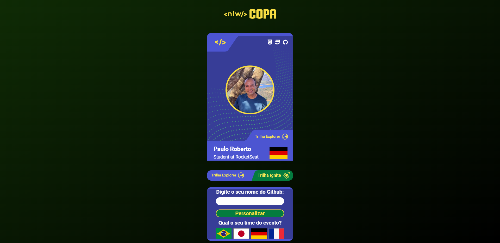
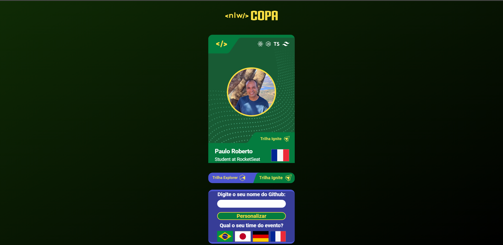

<h1 align="center">NLW Copa Card</h1>

Rocketseat / Rafael Vasconcelos

Paulo Roberto

---
 

## 📷 Imagens do Projeto

---

## 🚀 Tecnologias

Este projeto foi desenvolvido com as seguintes tecnologias:

 
    
  
  
  
  
  
  

 

## 💻 Projeto

 O projeto mostra o cartão que o usuario escolhe quando clica na trilha escolhida(Explorer quando iniciante; Ignite quando avançado). Podendo também escolher a bandeira do time que foi selecionada no primeiro desafio aplicada na comunidade do Discord da Rocketseat.

## 🔖 Layout

Você pode ver o projeto original [NESTE LINK](https://www.figma.com/file/olMhhLGXYcNIWrP9imy6wq/NLW-Copa-Card-(Copy)?node-id=0%3A1). Você deve ter uma conta no [Figma](https://figma.com) para poder acessar.

---

Criado pela Rocketseat / [Rafael Vasconcelos](https://github.com/rafacelos/rafacelos) e Paulo Roberto: [Junte-se a nossa comunidade no Discord!](https://discord.gg/rocketseat)
